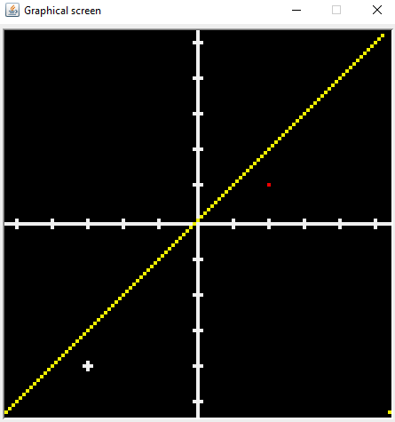

# SicDemos
This demo is part of SicDemos: a collection of assembly programs for the SIC/XE computer architecture. SicDemos is a companion project of [SicTools](https://github.com/jurem/SicTools) project (SIC/XE hypothetical computer simulator).

## Coordinate System
Plot some basic functions and points on a graph. The graph works on an interval of [-5, 5] and only with integers.
Use standard input to give the program instructions on what to draw. 
* Source code: KoordinatniSistem.asm
* Frequency: 10000 Hz = 10 kHz
* Standard input
* Author: Ambrož Janc, 2020

How to use:
 - graphical screen, 109x109 
 - frequency, 10000 (1000 works as well)
 - input: 
	- colour is element of {r - red, w - white, y - yellow, g - green}
	- x, y and n are elements of [-5, 5]
   - draw a point: 
		- pxyK{colour}
		- where K is optional and if used will draw the point as a cross
		- p22r -> draws point at x = 2, y = 2 in red colour
		- p-23Ky -> draws point as a cross at x = -2, y = 3 in yellow colour
   - draw a function:
		- functions have two ways of input:
			- y = x and y = -x : fx{colour} and f-x{colour}
			- y = n: fn{colour}
			- f-4w -> draws y = -4 function in white colour
			- fxr -> draws y = x function in red colour
	- clear screen: c
	- exit program: 0

## Coordinate System - graphical screen

Graphical animation of a coordinate system.
* Source code: KoordinatniSistem.asm
* Graphical screen: 109 rows x 109 columns at A000
* Frequency: 10000 Hz = 10 kHz

Commands to recreate the picture: 'p21r', 'p-3-4Kw', 'fxy'