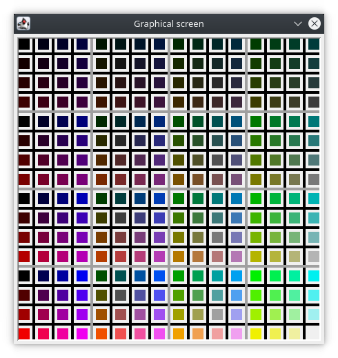

# SicDemos
This demo is part of SicDemos: a collection of assembly programs for the SIC/XE computer architecture. SicDemos is a companion project of [SicTools](https://github.com/jurem/SicTools) project (SIC/XE hypothetical computer simulator).

## Color table
A table of colors to help pick the colors to use in the graphical screen programs. Additional help for using the graphical screen can be found on the [Simulator documentation](http://jurem.github.io/SicTools/documentation/simulator).

* Source code: color-table.asm
* Graphical screen: 109x109 at A000
* Frequency: 100000 Hz = 100 kHz
* Author: Jakob Erzar, 2020

## Game of life
Animate [Conways' Game of Life](https://en.wikipedia.org/wiki/Conway's_Game_of_Life) on the graphical screen. The game is initialized with the glider figure at the top left corner.
* Source code: life.asm
* Graphical screen: 64x64 at A000
* Frequency: 10000000 Hz = 10 MHz
* Author: Jurij Mihelič

## H-tree fractal
Draw an H-tree fractal on the graphical screen.
* Source code: htree.asm
* Graphical screen 333x333 at A000
* Frequency: 10000 Hz = 10 kHz
* Author: Klemen Klanjšček, 2015

## The Chaos game Sierpinski triangle
The program draws the sierpinski triangle and is also capabile of drawing other fractals, that can be drawn by the chaos game, with a bit of tweeking.
The triangle is drawn iteratively, one point at a time, on a 200 by 200 window. This is implemented with two nested linear congruential generators.
* Source code: sier.asm
* Frequency: Depending uppon how fast you want the triangle to be rendered. 5000 Hz for medium speed and 10000 Hz for fast speed.
* Graphical screen: 200x200 at A000
* Author: Peter Mlakar, 2016

## Mandelbrot set visualization
Draw a visualization of the [Mandelbrot set](https://en.wikipedia.org/wiki/Mandelbrot_set) in the range between -2, 2, 2i and -2i.
For each pixel the color is computed as a number of iterations needed to escape the circle around 0 with the radius 2, mapped to a color range.
Almost all computation is done in floating point, save for loops and iteration count.
* Source code: mandel.asm
* Graphical screen 1000x1000 at A000
* Frequency: 10000000 Hz = 10 MHz
    * Drawing time can be vastly sped-up by resizing the screen or lowering the number of iterations, but appropriate variables must be adjusted (width, height, iter).
* Author: Blaž Rojc, 2018

## Rain drops
Simulates and visualizes rain on the graphical screen. Clock speed has to be at least 10000 = 10kHz but it needs to be increased with more drops and bigger screen. Drop count and screen size is adjustable. Change drops,count and randP to the desired drop count and scrow and sccol to the desired display dimensions (and then change the dimensions in the sictools simulator setting). At the start of the program random starting positions and seeds for the drops are set. After that an endless loop is executed where each drop is moved. 
 * Source code: rain.asm
 * Graphical screen: 64x64 at A000
 	* dimensions can be adjusted at will
 * Frequency: 10000Hz = 10KHz
 	* Must be adjusted if screen size od drop count is bigger 
 * Author: Martin Resman, 2019
